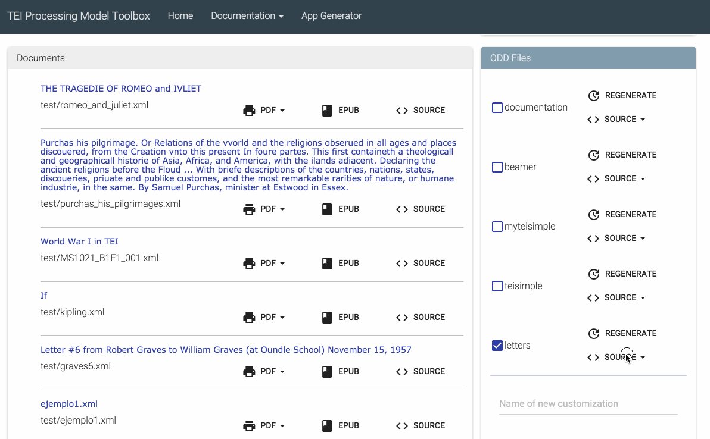

# TEI Publisher

The TEI Processing Model (PM) extends the TEI ODD specification format with a processing model for documents. That way intended processing for all elements can be expressed within the TEI vocubulary itself. It aims at the XML-savvy editor who is familiar with TEI but is not necessarily a developer.

The TEI Processing Model Toolbox for eXist facilitates the integration of the TEI processing model into existing applications, supporting a range of different output media without requiring advanced coding skills. Customising the appearance of the text is all done in TEI by mapping each TEI element to a limited set of well-defined behaviour functions, e.g. “paragraph”, “heading”, “note”, “alternate”, etc. The TEI Processing Model includes a standard mapping, which can be extended by overwriting selected elements. Rendition styles are transparently translated into the different output media types like HTML, XSL-FO, LaTeX, or ePUB. Compared to traditional approaches with XSLT or XQuery, TEI Simple may thus easily save a few thousand lines of code for media specific stylesheets.



## Demo

A demo of the app is available on

https://teipublisher.com/

Some applications using TEI publisher can be found on

http://showcases.exist-db.org/

## Installation

A prebuilt version of the app can be installed from eXist's central app repository. On your eXist installation, open the package manager in the dashboard and select "TEI Simple Processing Model" for installation. Dependencies should be installed automatically.

**Important**: Due to a bug in the 2.2 release, the tei-simple module requires [eXistdb 3.0RC1](https://bintray.com/existdb/releases/exist/3.0.RC1/view/files) or later.

## Documentation

For an overview of the app and library, please refer to my [presentation](http://showcases.exist-db.org/exist/apps/tei-simple/modules/latex.xql?odd=beamer.odd&doc=/doc/presentation.xml). There's also some [documentation](http://showcases.exist-db.org/exist/apps/tei-simple/doc/documentation.xml?odd=documentation.odd) available.

## Building

For PDF output, you need to enable the Apache FOP extension as follows:

* in extensions/build.properties, set "include.module.xslfo = true"
* rebuild eXist to install the Apache FOP libraries
* edit conf.xml and uncomment the fo module:

```xml
<module uri="http://exist-db.org/xquery/xslfo" class="org.exist.xquery.modules.xslfo.XSLFOModule">
    <parameter name="processorAdapter" value="org.exist.xquery.modules.xslfo.ApacheFopProcessorAdapter"/>
</module>
```

TEI publisher ships as a .xar package which can be installed into any eXist instance using the dashboard.

## License

This software is licensed under the [GPLv3](https://www.gnu.org/licenses/gpl-3.0.en.html) license. If you need a different license: please contact [us](mailto:mail@existsolutions.com) and we'll find an arrangement.

## References

* official TEI Spec - http://www.tei-c.org/release/doc/tei-p5-doc/en/html/TD.html#TDPM
* Extensions to the Processing Model Specification - http://teipublisher.com/doc/documentation.xml?root=1.4.2.2.10.14&odd=documentation.odd&view=div and following
